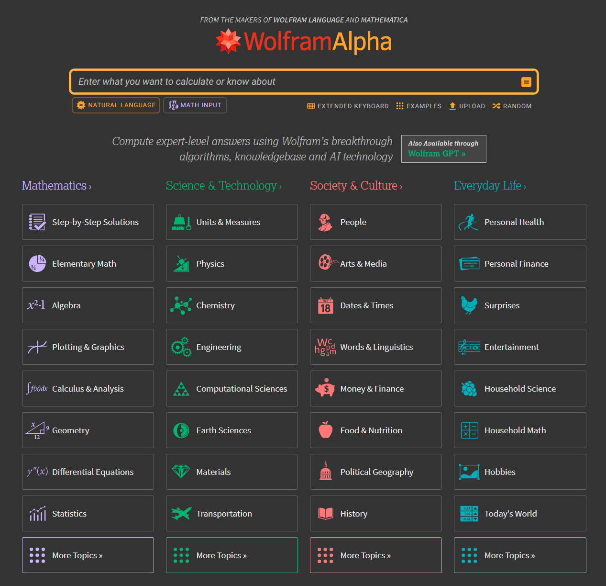
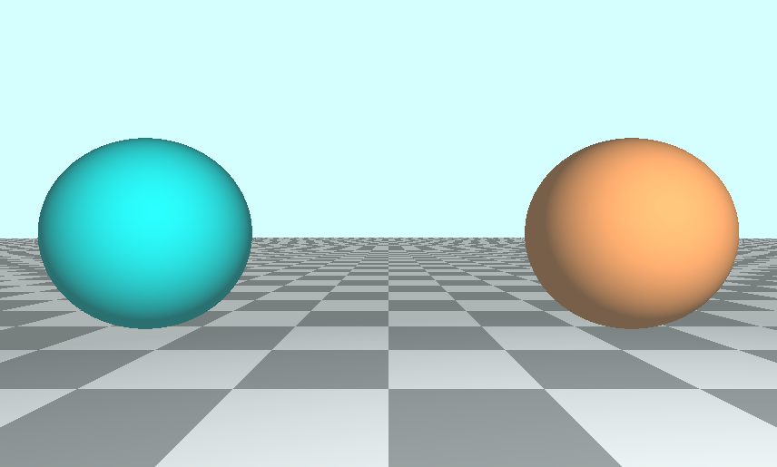

# L_Shadertoy
上班敲敲shadertoy，打发时间用...

> 少记文字笔记，切勿陷入茴香豆几种写法的误区...

## 0. 工具汇总
- 公式绘图：https://www.desmos.com/calculator?lang=zh-CN
- 矩阵运算：https://www.desmos.com/matrix?lang=zh-CN
- 系列科学工具：[WolframAlpha](https://www.wolframalpha.com/)
    - https://www.wolframalpha.com/input/?i=%5B%5Bcos%28t%29%2C-sin%28t%29%5D%2C%5Bsin%28t%29%2Ccos%28t%29%5D%5D+*%5Bx%2Cy%5D  
        
- [OpenGL® and OpenGL® ES Reference Pages](https://registry.khronos.org/OpenGL-Refpages/)
    - [Mix](https://registry.khronos.org/OpenGL-Refpages/gl4/html/mix.xhtml)

## 0. Shadertoy & Unity
- https://zhuanlan.zhihu.com/p/52287086

## 2. 使用SDF画一个圆
- 调整圆形比例，不随着窗口改变纵横比
- 使用iTime让圆随着时间改变颜色
- 让圆移动
- 空心圆【？】

## 3. 正方形和旋转
- 怎么让正方向不管怎么拖动，正方形都在所有屏幕中间？
- 让正方向旋转、旋转矩阵

## 4. 多个2D形状的混合
- mix / lerp
- 2D SDF就是公式
- 两次mix混合多种形状
- 最好的sdf就是返回距离，每个 draw 不返回 vec3
- 新增渐变背景（通过uv渐变）

## 5. 2D SDF
- 常见的各种2D SDF公式
- 2D SDF 操作

## 6. RayMarching
- 坐标系
    - shadertoy采用右手坐标系。
    - x 轴沿画布的水平轴，y 轴沿画布的垂直轴，并假设摄像机朝向 -z
- 光线算法之间的区别
    - ray casting
    - ray marching
    - ray tracing
    - path tracing
- RayMarching原理
    - https://www.youtube.com/watch?v=nMAgogUyv3E
    - https://www.desmos.com/calculator/ragaytzefw

## 7 绘制多个3D对象和多个颜色
- 添加多个物体
    - 使用 min 对 sdSphere 返回的最近距离操作
- 添加地板
    - mod 函数通常用于创建棋盘格或讲场景的部分增加 Tiling。
- 添加单独颜色
    1. 修改 SDF，返回 vec4，分别对应 SignDistance 和 Color
    2. 使用 Struct : [7_MultiObject](7_MultiObject.glsl)

    
    3. 使用 ID 为场景中不同物体进行着色 : [7_MapIDColor](7_MapIDColor.glsl)